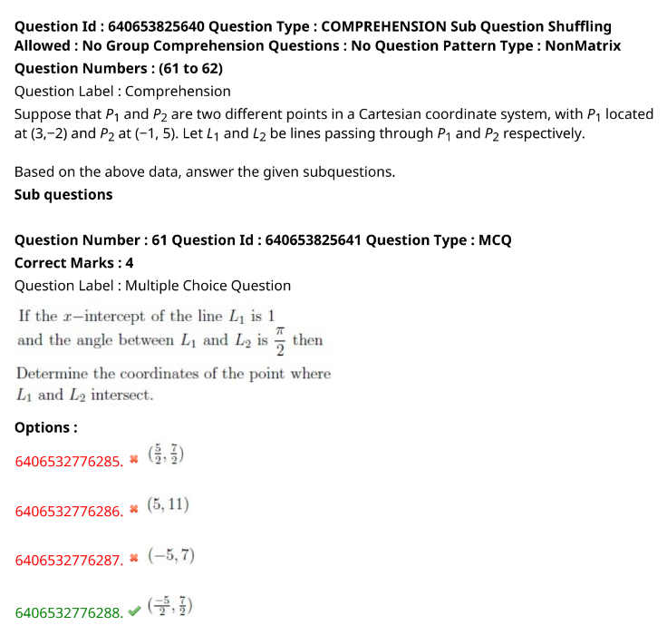
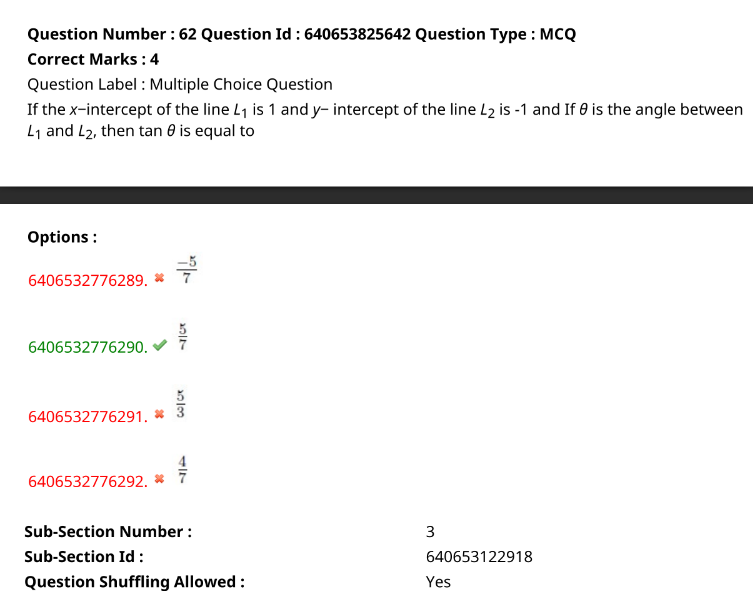
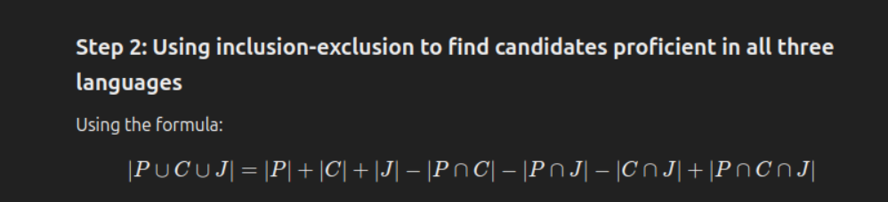

question - 60

The problem describes two lines \( L_1 \) and \( L_2 \) passing through points \( P_1(3, -2) \) and \( P_2(-1, 5) \) respectively, with additional conditions about their slopes and intersection.

Let me solve it step by step:

---

### **Step 1: Equation of Line \( L_1 \)**
The x-intercept of \( L_1 \) is \( 1 \). So, the line passes through points \( (1, 0) \) and \( (3, -2) \).

The slope \( m_1 \) is:
\[
m_1 = \frac{y_2 - y_1}{x_2 - x_1} = \frac{-2 - 0}{3 - 1} = -1
\]

Thus, the equation of \( L_1 \) is:
\[
y - (-2) = -1(x - 3) \implies y = -x + 1
\]

---

### **Step 2: Equation of Line \( L_2 \)**
The angle between \( L_1 \) and \( L_2 \) is \( \frac{\pi}{2} \). Since the two lines are perpendicular:
\[
m_1 \cdot m_2 = -1
\]
\[
-1 \cdot m_2 = -1 \implies m_2 = 1
\]

The slope of \( L_2 \) is \( 1 \), and it passes through \( P_2(-1, 5) \). So, its equation is:
\[
y - 5 = 1(x + 1) \implies y = x + 6
\]

---

### **Step 3: Intersection of \( L_1 \) and \( L_2 \)**
To find the intersection, solve:
\[
L_1: y = -x + 1 \quad \text{and} \quad L_2: y = x + 6
\]

Equating:
\[
-x + 1 = x + 6
\]
\[
2x = -5 \implies x = -\frac{5}{2}
\]

Substitute \( x = -\frac{5}{2} \) into \( y = x + 6 \):
\[
y = -\frac{5}{2} + 6 = \frac{7}{2}
\]

Thus, the intersection point is:
\[
\boxed{\left(-\frac{5}{2}, \frac{7}{2}\right)}
\]

question-61

# doubt

question-63

- formula

-----------------------------------------
question - 66
minima - 0,0
maxima - 0,0
finish
tommrrow eam

