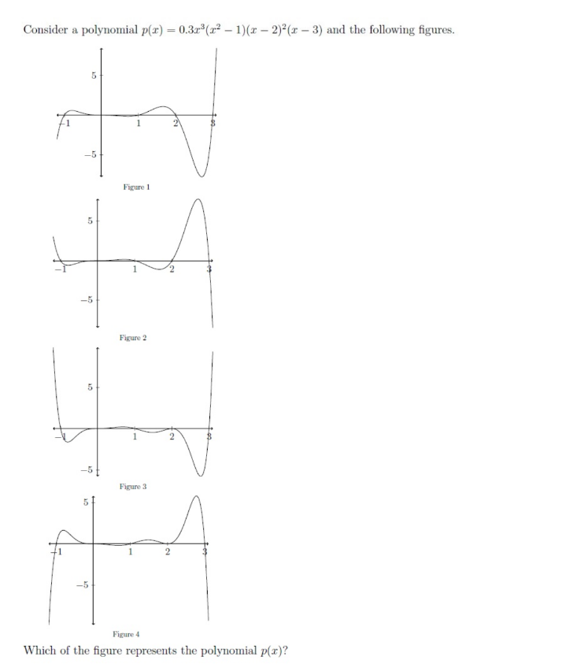
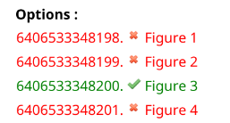
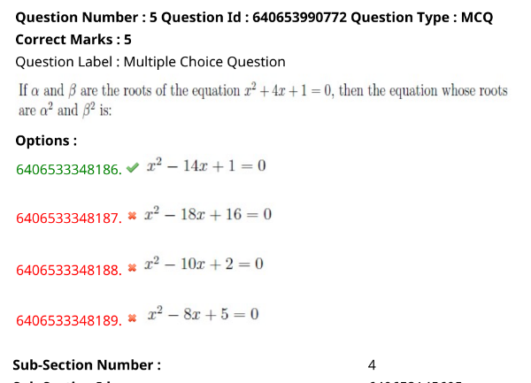

question-4

explanation : find the order of the equation like the greater number is the order and the if the equation has an multiple equation it will be added

question-5

explanation:
sum of roots = -b/a and product = c/a of roots are the formula 

question-6
symmetric - (a,b),(b,a)
transistive - (a,b)(b,c)=>(a,c)
reflexive - {(a,a),(a,b),(b,b)}
identity - (a,a),(b,b),(c,c)

question-8
use the venn diagram

(x^-x)**2+(y^-y)**2
squared formula